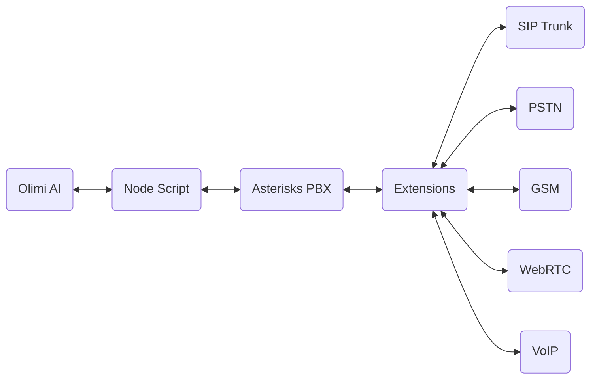

## How It Works
When we set out to build Olimi...

## Setting up

The first step to world-class documentation is setting up your editing environments.

<CardGroup cols={2}>
  <Card
    title="Account Setup"
    icon="pen-to-square"
    href="account-setup"
  >
    Get your docs set up locally for easy development
  </Card>
  <Card
    title="PBX Installation"
    icon="phone"
    href="installation"
  >
    Preview your changes before you push to make sure they're perfect
  </Card>
</CardGroup>

## Get Even Deeper

Update your docs to your brand and add valuable content for the best user conversion.

<CardGroup cols={3}>
  <Card
    title="REST API"
    icon="palette"
    href="api/introduction"
  >
    Customize your docs to your company's colors and brands
  </Card>
  <Card
    title="Webhook"
    icon="code"
    href="https://mintlify.com/docs/api-playground/openapi"
  >
    Automatically generate endpoints from an OpenAPI spec
  </Card>
  <Card
    title="PBX NPM Script"
    icon="screwdriver-wrench"
    href="https://mintlify.com/docs/components/accordion"
  >
    Build interactive features and designs to guide your users
  </Card>
</CardGroup>
