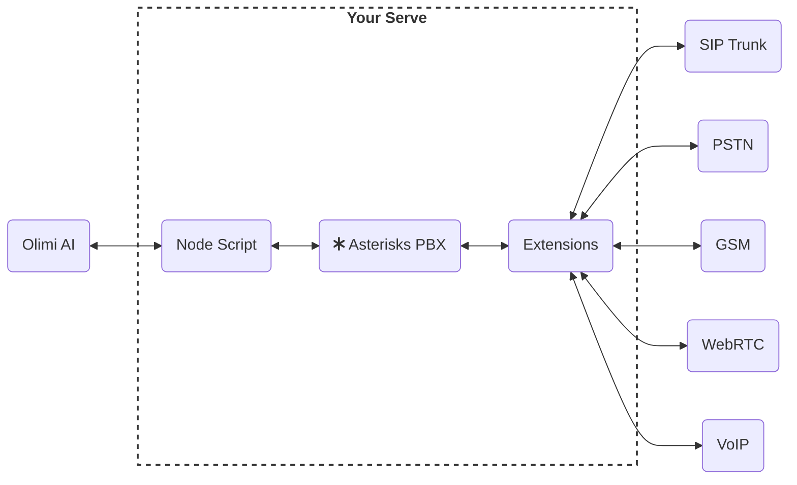

## How It Works
Olimi seamlessly integrates advanced AI technology with your existing communication infrastructure, revolutionizing how you manage and optimize your telecommunications.

Our innovative system connects Olimi AI to your server through a Node script, which interfaces with the Asterisk PBX. This setup allows for seamless integration with various communication channels, including SIP Trunks, PSTN, GSM, WebRTC, and VoIP, providing you with a versatile and powerful communication solution.

## Getting Started

To harness the full potential of Olimi, follow these essential steps:

<CardGroup cols={2}>
  <Card
    title="Account Setup"
    icon="pen-to-square"
    href="account-setup"
  >
    Configure your Olimi account for optimal performance and customization.
  </Card>
  <Card
    title="PBX Installation"
    icon="phone"
    href="installation"
  >
    Set up and integrate the Asterisk PBX with your existing infrastructure.
  </Card>
</CardGroup>

## Explore Advanced Features

Dive deeper into Olimi's capabilities to maximize your communication efficiency:

<CardGroup cols={3}>
  <Card
    title="REST API"
    icon="code"
    href="api-auth"
  >
    Leverage our API to integrate Olimi with your existing systems and workflows.
  </Card>
  <Card
    title="Webhook"
    icon="webhook"
    href="webhook/webhook"
  >
    Set up real-time notifications and automate actions based on communication events.
  </Card>
  <Card
    title="PBX NPM Script"
    icon="screwdriver-wrench"
    href="https://github.com"
  >
    Customize and extend Olimi's functionality using our Node.js scripts and modules.
  </Card>
</CardGroup>

We're excited to help you transform your communication infrastructure with Olimi. Explore our documentation to unlock the full potential of AI-powered telecommunications.
